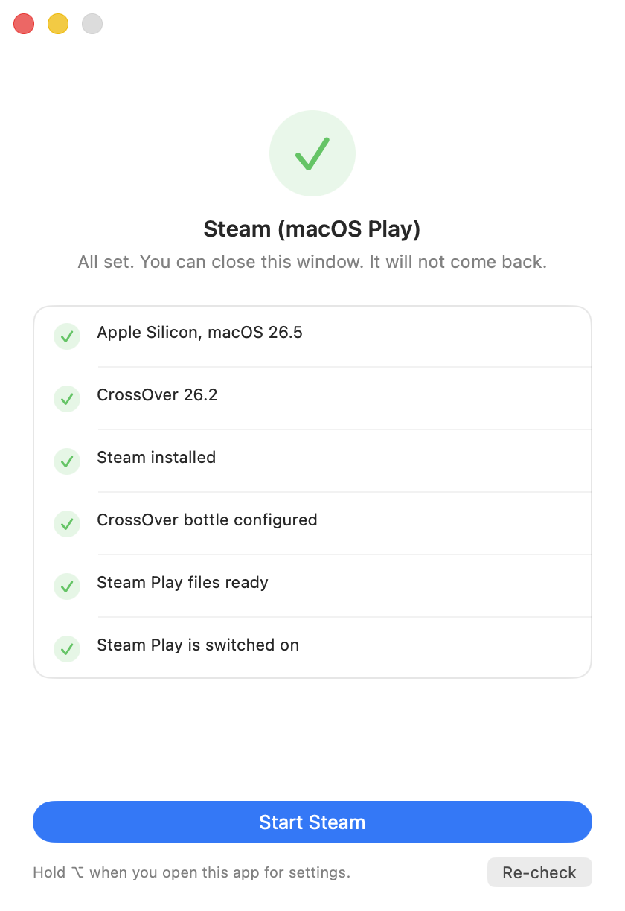

# macos-steam

MacOS Gaming has come a long way in the last few years: I have personally been using [Crossover](https://www.codeweavers.com/crossover) on my MacBook Pro for quite a while with great success, only one thing bothered me with the experience: having to have a dedicated steam for windows install, meaning I have two steam installs depending on if the game is native MacOS (yeah, there are a couple) or windows. Two libraries to manage.

This app is an attempt to brings the steamdeck's [Steam Play](https://store.steampowered.com/steamplay/) experience to MacOS: Download, Launch, Play from MacOS' Steam through crossover.

> **Status: working beta**
> Download is currently only via brew or from sources
> Project has been driven end-to-end on real
> retail titles on Apple Silicon, but it is young and it sits in
> Steam's launch path, so expect breakage. See [Known limits](#known-limits).

## Install

### Via Brew (recommended)

```sh
brew tap Superd22/macos-steam
brew install macos-steam-shim
macos-steam-shim # one time install command
```

### From a clone

#### Requirements

- Apple Silicon Mac, macOS 14+ (developed on macOS 26, M3 Pro).
- **CrossOver** in either `/Applications` or `~/Applications` (25.1.1 and 26.2 both exercised).
  CrossOver is required. The launch goes through its front door, so its D3DMetal/GPTK wiring comes along.
- The **native macOS Steam client** — installed, **opened at least once**, and signed
  in **online**. Steam.app is a bootstrapper; the client this project execs is the one
  Steam unpacks under `~/Library/Application Support/Steam/` on its first successful
  run, so a Steam that has been downloaded but never launched is not yet enough.
- Xcode command line tools (`xcode-select --install`) — Homebrew requires them anyway.
  The cross-compiler comes from the formula, so there is nothing else to install by hand.
  The contributor path, and the one to use if you want the sources in front of you:

```sh
brew install mingw-w64     # the formula's only dependency, by hand here
./src/installer/install.sh
```

Both paths cross the same build/deploy seam and produce the same two things:

- the **payload** in `~/Library/Application Support/macos-steam-shim/versions/<version>/` —
  the injector, the compat tool, and both bitnesses of the shim — with `current` pointed
  at it, and a `receipt.json` recording every file and its hash (ADR 0010).
- the **launcher** `~/Applications/Steam (macOS Play).app` — an unhardened `.app` that
  merges the injector into `DYLD_INSERT_LIBRARIES`, points Steam at the tool path, and
  execs Valve's own `steam_osx` unmodified.

The compat gate is flipped in memory at each launch, so the launcher is how you start Steam
from now on — clicking it when Steam is already running just focuses Steam, as it would
normally.

## First run

The first launch shows a checklist. It creates the CrossOver bottle for you if you have not
made one, and once Steam is up it reads the injector's log itself and confirms that Steam
Play switched on — you never have to open a log. After that it shows nothing at all and
behaves exactly like clicking Steam.app.



The bottle it creates is a clean `win10_64` with _no_ Windows Steam in it, which matters:
the shim is the entire client, and a real `steamclient64.dll` in the bottle would win the
lookup instead. To make it yourself, or to use a different one:

```sh
"$HOME/Applications/CrossOver.app/Contents/SharedSupport/CrossOver/bin/cxbottle" \
    --create --bottle steam-shim --template win10_64
```

(`steam-shim` is the default name; override it with `SHIM_BOTTLE` if you use another.)

Then **install and play a Windows title** from the normal Steam library UI. Steam downloads
the Windows depot into your macOS `steamapps`, then hands the `.exe` to the compat tool,
which launches it in the bottle against the shim.

**Hold ⌥ while opening the launcher** for settings, diagnostics and uninstall — or open
“Steam Play Settings” from Spotlight, which is the same pane. Diagnose runs the whole
troubleshooting table for you and hands you a report to paste into an issue.

The Steam overlay is **on by default** and lives in that pane as a toggle: changing it takes
effect at the next Steam launch and never needs a reinstall. The installer can set it too,
which writes the same preference the toggle does:

```sh
macos-steam-shim --overlay 0        # installed via brew
./src/installer/install.sh --overlay 0   # from a clone
```

### Checking, rolling back, uninstalling

Every deploy writes a receipt, and the installed payload carries the script that reads it —
so these work from anywhere, with no checkout:

```sh
macos-steam-shim --verify     # re-hash every deployed file against the receipt
macos-steam-shim --receipt    # what is installed: version, files, what it was tested against
macos-steam-shim --rollback   # swap back to the previous version
macos-steam-shim --uninstall  # launcher + payload + logs
```

Uninstall removes the launcher, the payload and the logs. Steam itself was never modified,
so there is nothing else to undo; the CrossOver bottle is left alone.

## Troubleshooting

Three logs cover almost everything. They live in `~/Library/Logs/macos-steam-shim/`, owner-only

| Log                  | What it tells you                                               |
| -------------------- | --------------------------------------------------------------- |
| `compat-enabler.log` | whether the compat gate was flipped                             |
| `shim-launch.log`    | what the compat tool was invoked with, and how it launched      |
| `shim-unix.log`      | every Steamworks call crossing the seam, per interface and slot |

Two failure modes account for most confusion:

- **Steam offline:** an offline client is a convincing false negative. Everything looks
  wired and nothing unlocks. Confirm you are signed in and online first.
- **A stray Windows Steam:** `ps aux | grep -i steam.exe` must be empty. If a Windows Steam
  is running in some bottle, it may be what answered, and the result proves nothing.

## What this project does

MacOS Steam already knows how to download a Windows depot and hand the `.exe` to a
compatibility tool, that has been built as Steam Play machinery for Proton on Linux. But two things prevent it from working on MacOS:

1. The feature is literally turned off on Steam's MacOS build.
2. Nothing on MacOS answers the Steamworks API for a Windows game.

This repo supplies both halves:

- **Turning the gate on:** a small injected dylib flips the client's latched
  `m_bCompatEnabled` at runtime, and a compat tool registers itself so every Windows-only title routes through it. Valve's own files are never modified.
- **Steamworks API via a bridge:** a replacement `steamclient64.dll` (and 32-bit `steamclient.dll`)
  inside the CrossOver bottle. It contains no Steam logic: it marshals every call across the Wine unix seam to a native `.so` that hosts Valve's real macOS `steamclient.dylib`,
  in-process. So the game talks to the _native_ Steam client. Achievements unlock on the real server; the overlay is Valve's own `gameoverlayrenderer.dylib`, injected into the game
  at process creation — or, for a DRM-wrapped title that cannot be injected into, loaded by the
  bridge itself and armed once the game's window is up.

The vocabulary above is defined in [CONTEXT.md](CONTEXT.md); the decisions behind it are in
[docs/adr/](docs/adr/).

## Known limits

- **Sources only:** no release artifact, no signed app, no Gatekeeper story yet.
- Anti-cheats probably won't work with overlay ON
- Not all Steam APIs are covered, see [#45](https://github.com/Superd22/macos-steam/issues/45). In practise: stuff might not behave as expected when a game talks to steam (friend list, server browser, workshop...)

## Related projects

The closest prior art, and the one this project is measured against, is
[**natbro/kaon**](https://github.com/natbro/kaon): kaon forces re-platforming _every_ app
globally and blocks the client's self-update; it merges the CrossOver bottle's Steam tree in
as a second library folder; And Steamworks is answered by **a real Windows Steam client running inside the same bottle**.

Those limitations were the reason this project came to be

Others that came up in the research:

- [Proton](https://github.com/ValveSoftware/Proton) and its `lsteamclient` — the Linux
  equivalent of Level B, and the source of the vtable layouts this shim generates from.
  ADR 0001 explains where the transports diverge.
- [Proton-mac-client](https://github.com/Toast-dev-wq/Proton-mac-client-) — an abandoned
  scaffold toward the same goal, kept as a record of a route not taken.
- [Millennium](https://github.com/SteamClientHomebrew/Millennium) and
  [Decky Loader](https://wiki.deckbrew.xyz/plugin-dev/cef-debugging) — Steam client modding
  through the CEF debug surface. That surface is a dev instrument here and never ships (ADR
  0002); kaon's issue #6 proposes it as a control path.
- [Steam-Play-None](https://github.com/Scrumplex/Steam-Play-None) and
  [steamtinkerlaunch's wiki](https://github.com/sonic2kk/steamtinkerlaunch/wiki/Steam-Compatibility-Tool)
  — the community reference for `compatibilitytool.vdf` and `toolmanifest.vdf` shape, since
  Valve documents neither.
- [CrossOver](https://www.codeweavers.com/crossover) — the Wine layer this builds on, and
  where Apple's Game Porting Toolkit reaches the game.

## Contributing

Contributions are welcome. [CONTRIBUTING.md](CONTRIBUTING.md) has the repo layout and its
admission rules, the commit conventions, and how a release is cut.
